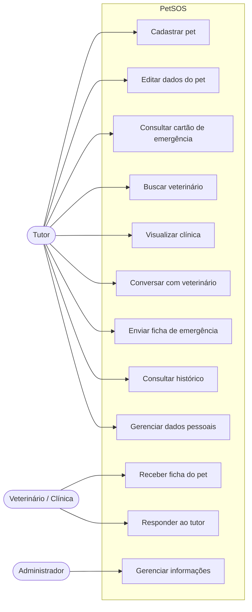
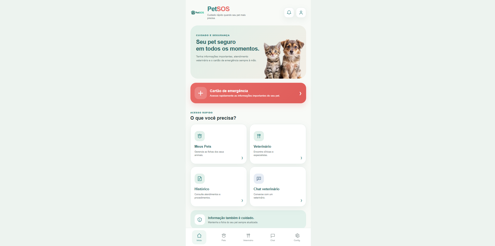
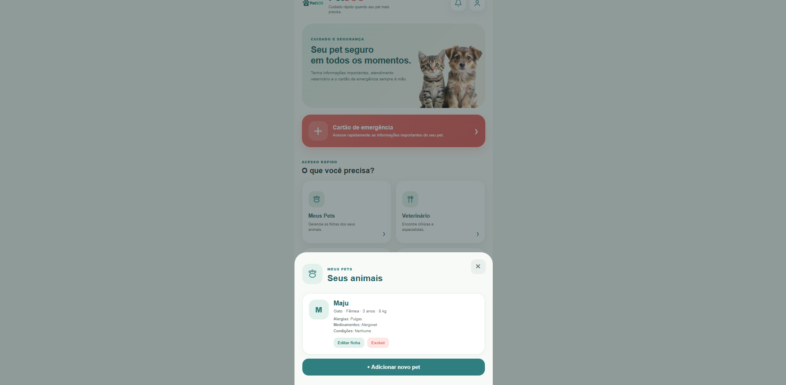
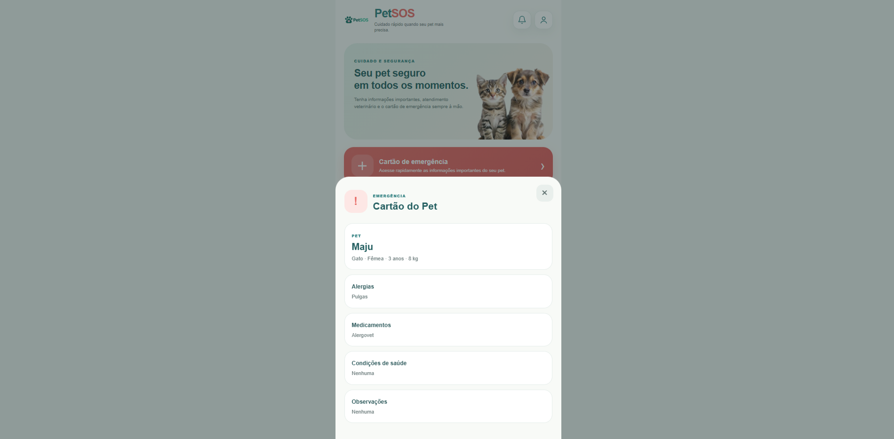
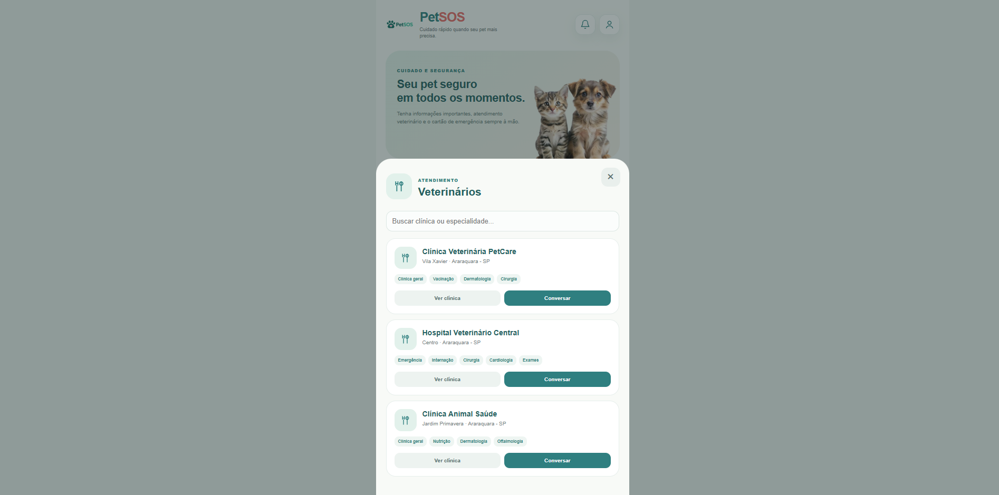
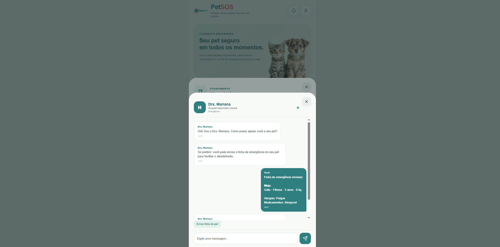
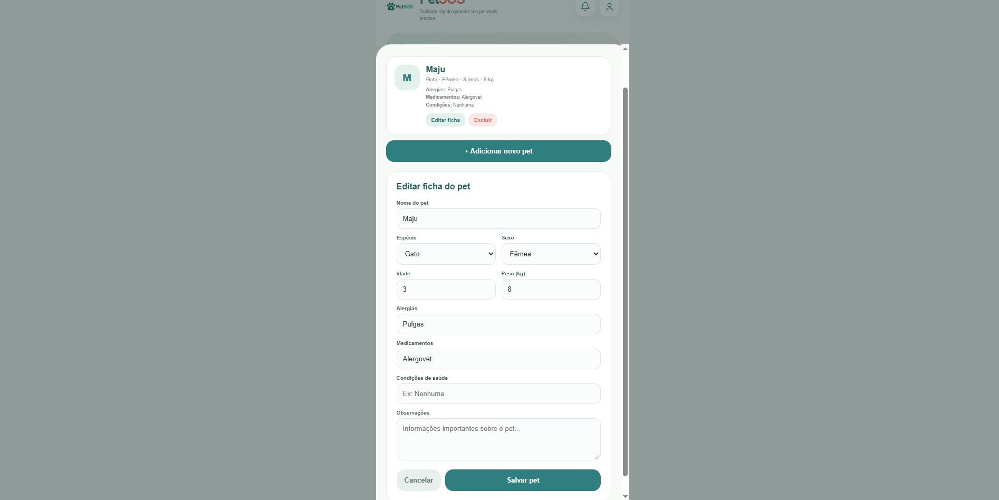
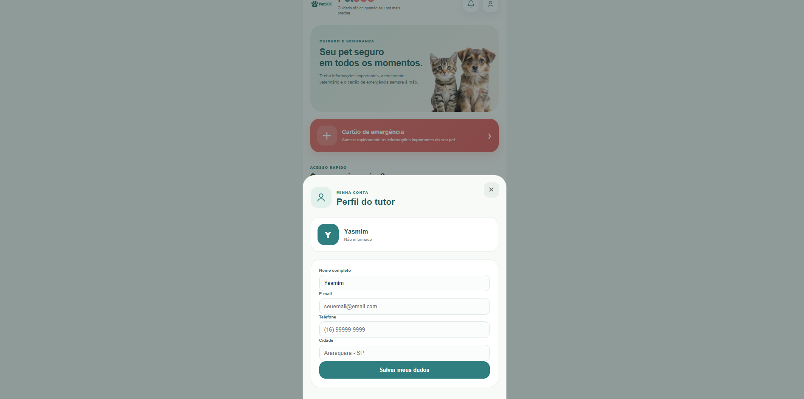

# 🐾 PetSOS — Plataforma de Atendimento e Emergência Veterinária

Informação rápida. Cuidado quando mais importa.

## 📖 Sobre o Projeto

O PetSOS é uma plataforma desenvolvida para auxiliar tutores de animais a encontrar atendimento veterinário e acessar rapidamente informações importantes sobre seus pets em situações de emergência.

A proposta combina cadastro de animais, informações de saúde, busca por atendimento veterinário e um Cartão de Emergência, permitindo que dados essenciais estejam organizados e disponíveis de forma rápida.

⸻

## 🎯 Objetivo

O principal objetivo do PetSOS é facilitar o acesso às informações do animal e ao atendimento veterinário, reduzindo o tempo necessário para encontrar dados importantes durante uma situação de emergência.

O sistema busca:

* Cadastrar e organizar informações dos pets;
* Armazenar alergias, medicamentos e condições de saúde;
* Disponibilizar um Cartão de Emergência;
* Facilitar a busca por clínicas e veterinários;
* Permitir o compartilhamento das informações do pet;
* Centralizar informações importantes em um único sistema.

⸻

## 👥 Público-Alvo

* Tutores de cães e gatos;
* Clínicas veterinárias;
* Médicos veterinários;
* Pessoas responsáveis por animais que precisam de atendimento rápido.

⸻

## ⚙️ Funcionalidades Principais

1. Cadastro de Pets

Permite cadastrar informações como:

* Nome;
* Espécie;
* Sexo;
* Idade;
* Peso;
* Alergias;
* Medicamentos;
* Condições de saúde;
* Observações.

2. Cartão de Emergência

Apresenta rapidamente as principais informações de saúde do animal para facilitar um possível atendimento veterinário.

3. Busca de Veterinários

Permite pesquisar clínicas e visualizar:

* Localização;
* Horário de atendimento;
* Telefone;
* Especialidades.

4. Chat Veterinário

Permite simular uma conversa entre tutor e veterinário, incluindo o envio da ficha de emergência.

5. Histórico

Centraliza registros de consultas e procedimentos realizados pelo pet.

6. Perfil do Tutor

Permite armazenar os dados básicos do responsável pelo animal.

⸻

## 🗺️ Diagramas de Caso de Uso e Sequência

## Diagrama de Caso de Uso

## Demonstração do Aplicativo

<table>
  <tr>
    <td align="center">
      <strong>Página Inicial</strong> 
      
    </td>
    <td align="center">
      <strong>Meus Pets</strong> 
      
    </td>
    <td align="center">
      <strong>Cartão Pet</strong> 
      
    </td>
  </tr>

  <tr>
    <td align="center">
      <strong>Procurar Veterinário</strong> 
      
    </td>
    <td align="center">
      <strong>Chat Veterinário</strong> 
      
    </td>
    <td align="center">
      <strong>Ficha Pet</strong> 
      
    </td>
  </tr>

  <tr>
    <td align="center">
      <strong>Informações Veterinárias</strong> 
      
    </td>
    <td align="center">
      <strong>Perfil do Tutor</strong> 
      
    </td>
    <td align="center">
      <strong>Configurações</strong> 
      
    </td>
  </tr>
</table>

## 🛠️ Tecnologias utilizadas

### 💻 Front-end

### 🔧 Versionamento

## 🗂️ Estrutura do Projeto

PetSOS/
│
├── index.html
│
├── css/
│   └── style.css
│
├── js/
│   └── script.js
│
├── img/
│   ├── logo.petSOS.png
│   └── animais.petSOS.png
│
└── README.md

## 🚀 Roadmap do MVP

Milestone 1 — Estrutura Inicial

* [x]	Criar estrutura do projeto;
* [x]	Criar interface inicial;
* [x]	Configurar HTML e CSS.

Milestone 2 — Cadastro de Pets

* [x]	Cadastro;
* [x]	Edição;
* [x]	Exclusão;
* [x]	Informações de saúde.

Milestone 3 — Cartão de Emergência

* [x]	Visualização das informações;
* [x]	Acesso rápido;
* [x]	Compartilhamento simulado pelo chat.

Milestone 4 — Atendimento Veterinário

* [x]	Busca de clínicas;
* [x]	Especialidades;
* [x]	Informações da clínica;
* [x]	Chat simulado.

Milestone 5 — Polimento

* [x]	Interface responsiva;
* [x]	Identidade visual;
* [x]	Logo;
* [x]	Ilustrações;
* [x]	Organização da documentação.

## 🔒 Requisitos Não Funcionais

Os requisitos não funcionais definem características de qualidade que o sistema deverá apresentar.

* RNF05 — Disponibilidade: o sistema deverá estar disponível para acesso sempre que o usuário precisar utilizar suas funcionalidades.
* RNF06 — Acessibilidade: a interface deverá utilizar elementos visuais e textos que facilitem a utilização por diferentes usuários.
* RNF07 — Manutenibilidade: o código deverá ser organizado de forma que futuras alterações e melhorias possam ser realizadas com facilidade.

## 📱 Telas do sistema

* 🏠 Tela inicial — acesso às principais funcionalidades.
* 🐶 Perfil do pet — informações e dados de saúde do animal.
* 🚨 Cartão de Emergência — informações essenciais para situações de urgência.
* 🏥 Busca por atendimento — clínicas e hospitais veterinários.
* 📋 Histórico — consultas e procedimentos realizados.
* ⚙️ Configurações — gerenciamento da conta e dos pets.
